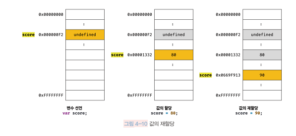

🔐 개념 숙지

> - 변수
> - 할당
> - 표현식
> - 값
> - 문
> - 리터럴

💡생각해보기

> - console.log()에서 undefined 찍히는 이유
>   - tag : 표현식이 아닌 문, 완료값, REPL
> -

## 4. 변수

- 변수 variable : 하나의 값을 저장하기위해 확보한 메모리 공간 자체 또는 그 식별을 위해 붙인 이름

- 할당 assignment : 변수에 값을 저장하는 것

- 참조 reference : 저장된 값을 읽어 들이는 것

- 키워드 keyword: 자바스크립트 코드를 해석하고 실행하는 자바스크립트 엔진이 수행할 동작을 규정한 일종의 명령어 (ex. var, let, const …)

cf. 선언 및 할당 논란 (정확히는 재선언, 재할당) - Deep Dive 6장 p.66 선언과 정의 참고


→ const 키워드로 변수 선언하면 재할당이 금지된다. 따라서 한 번만 할당할 수 있는 변수(즉, 상수)를 표현할 수 있다

### 메모리 공간



변수에 값을 재할당하면 score 변수의 값은 이전 값 80에서 재할당한 값 90으로 변경된다. 처음 값을 할당했 을 때와 마찬가지로 이전 값 80이 저장되어 있던 메모리 공간을 지우고 그 메모리 공간에 재할당 값 90을 새 롭게 저장하는 것이 아니라 _새로운 메모리 공간을 확보하고_ 그 메모리 공간에 숫자 값 90을 저장한다.

현재 score 변수의 값은 90이다. score 변수의 이전 값인 undefined와 80은 어떤 변수도 값으로 갖고 있지 않다. 다시 말해, 어떤 식별자와도 연결되어 있지 않다. 이것은 undefined와 80이 더 이상 필요하지 않다는 것을 의미한다. 아무도 사용하고 있지 않으니 필요하지 않은 것이다. 이러한 불필요한 값들은 가비지 콜렉터(GC garbage collector) 에 의해 메모리에서 자동 해제된다. 단, 메모리에서 언제 해제될지는 예측할 수 없다.

<details><summary>🐍 cf. python GC </summary>
python의 경우 모든 것이 객체다. 파이썬에서 변수를 할당한다는 것은 해당 객체에 대해 참조를 한다는 의미. 객체의 참조횟수(reference  count)가 0이 되면 가비지 컬렉터(GC garbage collector)가 그 객체가 차지하는 메모리를 해제한다.
</details>
<br>

- 런타임 runtime : 소스코드가 한 줄씩 순차적으로 실행되는 시점

- 변수 호잉스팅 variable hoisting : 런타임 이전에 소스코드의 평가 과정 있음. 변수 선언이 코드 선두로 끌어 올려진 것처럼 순차적 런타임 이전에 먼저 실행되는 JS의 특징

변수선언은 호이스팅되어 런타임 이전에 실행되고 값의 할당은 런타임에서 실행됨

var의 경우 런타임 이전에 변수선언 실행되면 (값 할당 전) undefined로 초기화 되어 있음

값이 할당되면 undefined에서 새로 할당된 값으로 재할당되는 것임

## 5. 표현식과 문

- 값value은 식(표현식expression)이 평가evaluate되어 생성된 결과를 말한다.

- 표현식 exression은 값으로 평가될 수 있는 문statement 이다. 표현식이 평가되면 새로운 값을 생성하거나 기존 값을 참조한다.

- 평가 evaluate 란 식을 해석해서 값을 생성하거나 참조하는 것을 의미한다.

- 리터럴 literal 은 값을 생성하기 위해 미리 약속한 표기법이다. 리터럴은 값으로 평가되므로 리터럴도 표현식이다.

- 키워드 keyword는 자바스크립트 코드를 해석하고 실행하는 자바스크립트 엔진이 수행할 동작을 규정한 일종의 명령어이다. (ex. var, let, const …)

### 리터럴 literal

사람이 이해할 수 있는 문자 또는 약속된 기호를 사용해 값을 생성하는 표기법 notation


❕객체나 배열을 선언할 때 생성자를 사용하지 말고, 리터럴 표기법을 사용하는 것이 가독성과 속도 면에서 좋다.

### 표현식

값으로 평가될 수 있는 모든 문은 표현식이다.

```jsx
var score = 100; //100은 리터럴이고 그 자체로 표현식
var score = 50 + 50; // 50 + 50 은 평가되어 100을 생성하므로 표현식
score; // 100. 식별자를 참조해 값을 생성하지는 않지만 값으로 평가되므로 표현식
```

### 문 statement

문 = 명령문

프로그램을 구성하는 기본단위이자 최소 실행단위. token으로 구성됨

문은 선언문, 할당문, 조건문, 반복문 등으로 구분할 수 있다.

문이 끝날때마다 세미콜론을 붙여 JS 엔진이 문의 종료 위치를 파악하고 실행할 수 있도록 한다.

JS엔진은 문의 끝이라고 예측되는 지점에 세미콜론을 자동으로 붙여주는 기능이 있다.

**표현식과 문의 구별**

- 표현식인 문은 값으로 평가될 수 있다
- 표현식이 아닌 문은 값으로 평가될 수 없다
- 변수선언문은 값처럼 사용할 수 없으므로 표현식이 아닌 문이다.
- 변수의 할당문은 값처럼 사용할 수 있으므로 표현식인 문이다.

### 완료값 completion value

크롬 개발자 도구에서 표현식이 아닌 문을 실행하면 언제나 undefined 출력. 이를 완료값이라고 한다.

완료값은 표현식의 평가 결과가 아니다.

표현식인 문을 실행하면 언제나 평가된 값을 반환한다.

- The console will print the result of evaluating an expression.
- A variable declaration does not produce a value so again `undefined`
   is printed to the console.


#### reference
  [https://stackoverflow.com/questions/24342748/why-does-console-log-say-undefined-and-then-the-correct-value](https://stackoverflow.com/questions/24342748/why-does-console-log-say-undefined-and-then-the-correct-value)

[Why does console.log() return 'undefined'?](https://blog.bitsrc.io/why-does-console-log-return-undefined-e06d44b4d0f8)

[https://velog.io/@ingdol2/JS-console.log만-찍어도-undefined-나오는-이유](https://velog.io/@ingdol2/JS-console.log%EB%A7%8C-%EC%B0%8D%EC%96%B4%EB%8F%84-undefined-%EB%82%98%EC%98%A4%EB%8A%94-%EC%9D%B4%EC%9C%A0)

<br>
<br>

## 6. 데이터 타입

JS의 데이터타입은 7개 (ES6 기준)

| 구분     | 데이터타입     | 설명                        |
| -------- | -------------- | --------------------------- |
| 원시타입 | 숫자 number    | 숫자, 정수, 실수 구분 X     |
|          | 문자열 string  |                             |
|          | 불리언 boolean |                             |
|          | undefined      |                             |
|          | null           | 값이 없음을 의도적으로 명시 |
|          | symbol         | es6에서 추가된 7번째 타입   |
|          | Bigint         | es11에서 추가된 8번째 타입  |
| 객체타입 |                | 객체, 함수, 배열            |

In [JavaScript](https://developer.mozilla.org/en-US/docs/Glossary/JavaScript) , a **primitive**  (primitive value, primitive data type) is data that is not an [object](https://developer.mozilla.org/en-US/docs/Glossary/Object)
 and has no [methods](https://developer.mozilla.org/en-US/docs/Glossary/Method)  or [properties](https://developer.mozilla.org/en-US/docs/Glossary/property/JavaScript)

1. [BigInt](https://developer.mozilla.org/en-US/docs/Glossary/BigInt). An integer with arbitrary precision. For example: `9007199254740992n`.

1. [Symbol](https://developer.mozilla.org/en-US/docs/Web/JavaScript/Reference/Global_Objects/Symbol). A data type whose instances are unique and immutable.
   .

### 숫자타입

ES 사양에 따르면 숫자타입은 **배정밀도 64비트 부동소수점** 형식의 **2진수**.

#배정밀도, 단정밀도, 부동소수점방식의 가수부분(용량)

- 👍 [https://gigglehd.com/gg/hard/5427559](https://gigglehd.com/gg/hard/5427559)
  - 컴퓨터의 숫자 연산은 2가지 -정수연산, 소수연산.
  - 고정소수점방식, 부동소수점방식, - 다루는 값의 범위가 정해져있다면 고정소수점 방식이 오히려 편하지만 예상못하는 경우는 부동소수점 방식이 공간 덜 차지함.
  - 부동소수점 방식은 가수부분 + 지수부분 형식.
  - 부동소수점의 표준은 제조사 각각에서 IEEE표준으로.
  - binary32, decimal32가 단정밀도. 여기서 반정밀도, 배정밀도 계산하면 됨. (가수부분 유효숫자가 늘어날수록 취급값의 범위가 넓어짐)
  - 기본이 되는 단정밀도 부동소수점 binary32의 경우 이진수를 10진수로 변환하면 오차가 생김
  - 10진법은 1.1+0.1=1.2가 당연하지만 2진법에선 1.1에 한없이 가까운 값 + 0.1에 한없이 가까운 값 = 유효숫자의 범위에따라 가끔1.2가 안되는 경우가 있음
  - 1991 걸프전에서 미 패트리어트가 이라크 스커드 요격 실패는 미국이 24bit 카운터를 써서 시간 측정하면서 2진수 → 10진수 변환 요차가 쌓이면서 0.34초 타이밍 어긋났기 때문 → 단정밀도 부동소수점 연산 100시간 실행하니 0.34초 오차 생겼음.
  - 속도와 정확성이 반비례. 단정밀도에 비해 배정밀도는 2~4배 속도 느림.
  - 머신러닝의 CNN의 경우 23bit 가수부분을 가진 단정밀도 부동 소수점은 낭비이고 반정밀도로도 활용분야 많음.

즉, JS의 숫자 타입은 모든 수를 실수로 처리하는 것. 정수만을 위한 타입이 따로 없다.

따라서 정수로 표시되는 수끼리 나누더라도 실수가 나올 수 있다.

2진수, 8진수, 16진수를 표현하기 위한 데이터 타입을 따로 제공하지 않으므로 이들 값을 참조하면 모두 10진수로 해석된다.

```jsx
var binary = 0b01000001; // 2진수
var octal = 0o101; // 8진수
var hex = 0x41; // 16진수

// 표기법만 다를 뿐 모두 같은 값이다.
console.log(binary); // 65
console.log(octal); // 65
console.log(hex); // 65
console.log(binary === octal); //true
console.log(octal === hex); //true
```

• Octal literals start with `0o` followed by a sequence of numbers between `0 and 7`.

• Binary literals start with `0b` followed by a sequence of number `0 and 1`.

• Hex literals start with `0x` followed by a sequence of number `0 and 9` , and alphabet `a` to `f`.

- converting strings to numbers

`parseInt(string, radix)` radix는 밑수 (=base)

- converting number to strings

`toString()` 인자로 주는 base로 변환된 문자열 반환

### 문자열 타입

문자열은 작은따옴표(''), 큰따옴표("") 또는 백틱(``)으로 텍스트를 감싼다. 만약 문자열을 따옴표로 감싸지 않으면 자바스크립트 엔진은 키워드나 식별자 같은 토큰으로 인식한다

```jsx
var string = hello; // ReferenceError: hello is not defined
```

- **템플릿 리터럴**
  - 문자열 표기법이다.
  - 백틱을 사용해 멀티라인, 표현식 삽입 가능하다
  - 템플릿 리터럴 이용하지 않으면 멀티라인 표현 위해 이스케이프 시퀀스 사용해야 한다.
  - 표현식 삽입시엔 `${ }` 이용
  - 이스케이프 시퀀스 escape sequence
  
    
  - 개행문자 CRLF
    
    과거 타자기에서 커서 제어는 캐리지 리턴 carriage return과 라인피드 line feed로 커서를 맨 앞줄로 이동하거나 커저 정지 상태에서 종이를 한 줄 올릴 수 있었다.
    CR(\r)
    LF(\n)
    ⇒ JS에서는캐리지 리턴 (\r)로 개행하는 경우는 거의 없고 일반적으로 라인피드(\n)로 개행한다.
  - 컴퓨터 운영 체제와 개행 방식
  
    윈도우즈 - CR + LF
    유닉스 - LF
    macOS - ver.9까지는 CR, ver10부터는 LF

### 불리언타입

true, false 밖에 없다

### undefined 타입

undefined가 유일하다.

undefined는 변수 선언으로 확보된 메모리 공간을 JS 엔진이 쓰레기값으로 두지 않고 초기화해두는 값이다. 따라서 변수 선언 후 값을 할당하지 않은 변수를 참조하면 undefined 가 반환된다.

개발자가 의도적으로 할당하는 값이 아니라 JS 엔진이 변수를 초기화할 때 사용하는 값이다. (개발자가 undefined를 할당하는 건 비추) 따라서 변수에 값이 없다는 것을 명시하고 싶을때는 null을 할당하면 된다.

📜 선언과 정의

JS에서는 선언과 정의의 구분이 모호.

C언어에선 실제로 메모리 주소를 할당하는가로 구분함.

선언 : 단순히 컴파일러에게 식별자의 존재만 알리는 것

정의 : 실제로 컴파일러가 변수를 생성해 메모리 주소에 연결하는 것.

### null 타입

null이 유일.

null은 변수에 값이 없다는 의도적 부재 intentional absence 명시할때 사용한다.

변수에 null을 할당하면 변수가 이전에 참조하던 값을 더이상 참조하지 않겠다는 의미.

함수가 유효한 값을 반환할 수 없는 경우 명시적으로 null을 반환하기도 한다.

### symbol 타입

변경 불가능하고 유일무이한 원시타입의 값이다. 주로 객체의 유일한 프로퍼티 키를 만들기 위해 사용한다.

### 객체 타입

[ 11장. 원시값과 객체의 비교]

### 데이터타입의 필요성

- 값을 저장할 때 필요한 메모리 공간 확보
  - ECMAScript가 명시한 크기는 숫자 타입과 문자열 타입. 숫자는 배정밀도 64비트 부동소수점 형식이므로 숫자값의 데이터 크기는 8바이트
- 값을 **참조**할 때 한번에 읽어 들어야할 메모리 공간의 크기 결정 하기 위해
- 메모리에서 읽은 2진수를 어떻게 해석할지 결정하기 위해
  - 데이터 타입에 따른 값의 해석
  - 0100 0001은 숫자로는 65, 문자열로는 A이다.

### 동적 타이핑

JS의 변수는 데이터 타입을 변수 선언시가 아니라 할당시에 추론한다. type inference. 재할당에 의해 변수 타입은 언제든 동적으로 변할 수 있다. ⇒ 동적 타이핑 dynamic typing

따라서 JS의 변수는 기본적으로 타입을 갖지 않는다. 변수에 할당되는 값이 타입을 갖고 이에 의해 변수의 타입이 동적으로 결정된다.

정적 타입 언어(ex. C ) 변수 선언시 데이터 타입을 사전에 명시적으로 선언해야한다. 이에 맞는 값만 할당 할 수 있다. 컴파일 시점에 타입 체크하고 불통시 에러 발생.

- **동적 타입 언어의 구조적 단점**
  - 변수값은 언제든 변경될 수 있기 때문에 타입도 언제든 변경될 수 있다. 즉 값을 확인하기 전에는 변수의 타입을 확신할 수 없다.
  - JS 엔진에 의해 암묵적으로 타입이 자동으로 변환되기도 한다.
  - 유연성은 높지만 신뢰성은 떨어진다.
  - 따라서 typescript가 등장하게 된 것 같다
  - 변수의 유효범위인 스코프를 최대한 좁게 만들어 변수의 부작용을 줄여야 한다.
  - 전역변수의 사용 자제

## 7. 연산자

| 연산자                            | 설명                                                                 |
| -------------------------------- | ------------------------------------------------------------------- |
| 산술연산자 arithmetic operator    | _ 피연산자 대상 수학적 계산. _ 연산 불가면 NaN _ 이항 산술연산자 : +, -, _, /, % \ _ 단항 산술연산자 : ++, —, +, -                                                                   |
| 비교연산자 comparision operator   | _ 동등비교 == 값을 비교 느슨한 비교. 암묵적 타입 변환으로 타입 일치수 같은 값인지 비교. _ 일치비교 === 값과 타입을 비교. 엄격비교. 삼중등호연산자                                   |
| 삼항 조건 연산자 ternary operator | \* if ~ else는 표현식이 아닌 문이므로 값처럼 사용할 수 없다. 반면 상항 조건 연산자 표현식은 값처럼 사용할 수 있다.(변수에 할당하는 경우 유리하게 사용할 수 있다)                    |
| 논리연산자 logical operator       | _ 논리곱(&&) _ 논리합(                                                                                                                                                              |     | ) \* 부정(!) - 피연산자가 boolean이 아니면 암묵적 타입 변환. |
| 쉼표연산자                        | \* 왼쪽 피연산자부터 차례로 평가하고 마지막 피연산자의 평가 결과를 반환                                                                                                             |
| 그룹연산자                        | \* 소괄호 ( ) 로 묶고 연산자 우선순위가 가장 높다                                                                                                                                   |
| typeof 연산자                     | \* 피연산자의 데이터 타입을 문자열("string", "number", "boolean", "undefined", "symbol", "object", "function”)로 반환                                                               |
| 지수연산자                        | _ ES7에서 도입 \*\* 로 표기. 이전에는 Math.pow() 사용 _ 좌항 피연산자를 밑base, 우항 피연산자를 지수 exponent \* 할당연산자와 함께 사용할 수 있고 이항 연산자 중 우선순위 가장 높다 |

증감 연산자의 경우 (++, —) 위치에 따라 값의 변경이 다르다

+, - 연산자는 부수 효과는 없지만 숫자 타입으로 변환한 값을 생성한다. (만약 숫자타입으로 변환할 수 없으면 NaN )

JS 엔진에 의해 암묵적으로 타입 자동변환 되기도 한다

[9장. 타입변환과 단축평가]

논리연산자

논리 부정 ( ! ) 연산자 는 언제나 불리언 값 을 반환 한다 . 단 , 피연산자 가 반드시 불리언 값일 필요 는 없다 . 만약 피연산자 가 불리언 값 이 아니면 불리언 타입 으로 암묵적 타입 변환 된다 .

논리합 ( ||) 또는 논리 곱 ( && ) 연산자 표현식 의 평가 결과 는 불리언 값 이 아닐 수도 있다 . 논리합 ( || ) 또는 논 리곱 ( && ) 연산자 표현식 은 언제나 2 개의 피연산자 중 어느 한쪽 으로 평가 된다 .

```jsx
"cat" && "dog"; // -> 'dog'
```

→ 단축평가와 연결

typeof 연산자로 null 값을 연산해 보면 "null"이 아닌 "object"를 반환한다는 데 주의하자. 이것은 자바 스크립트의 첫 번째 버전의 버그다. 또한 선언하지 않은 식별자를 typeof 연산자로 연산하면 ReferenceError 발생하지 않고 undefined 반환한다.
